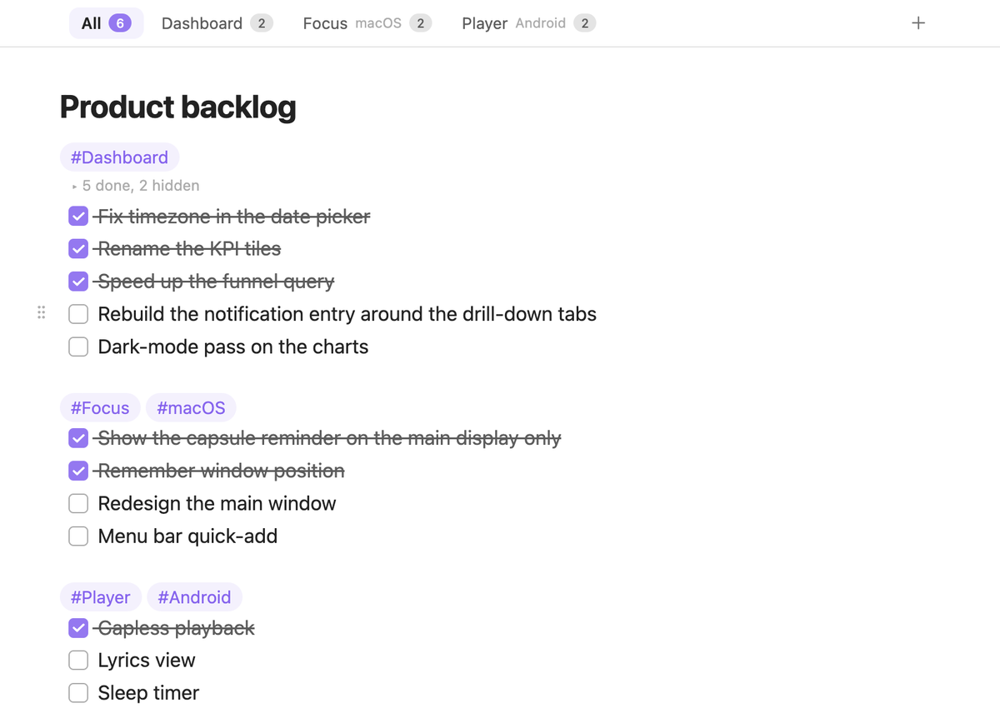
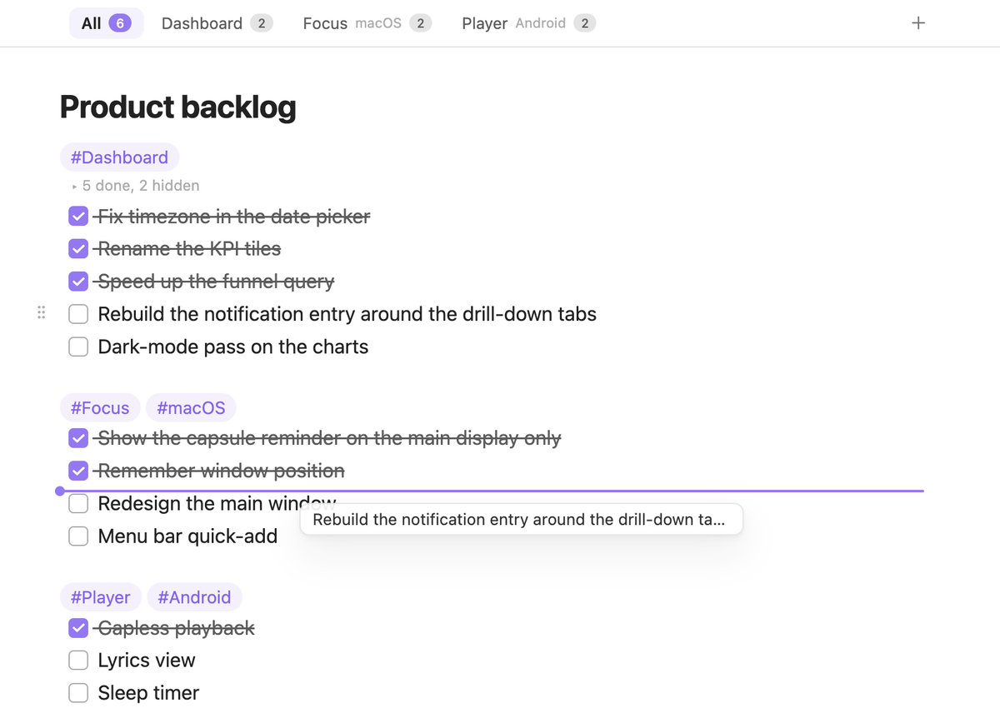

# Task Pool

[中文说明](README.zh-CN.md)

Turn a plain Markdown task list into a backlog you can live in. Completed tasks fold away, `#tag` sections become tabs, blocks drag like cards, and the note itself stays put in a small pinned tab. Everything remains standard Markdown, so nothing changes when the plugin is off.



## Features

### Completed tasks fold away

Once a run of completed tasks grows past a limit (3 by default), the older ones collapse behind a single "5 done, 2 hidden" line while the most recent ones stay visible for context. Click the line to expand, or just move the cursor into it. Works the same in editing and reading views.

### Tag sections become tabs

Write a line that contains only tags, such as `#Focus #macOS`, and everything below it is a section. As soon as a note has two or more sections it gets a tab bar with open-task counts. Pick a tab to see just that product; `+` adds a task at the end of it. A path list or a `task-tabs` note property can force the bar on or off.

### Drag blocks like cards

Hover any list item, paragraph, heading or code block and a ⋮⋮ handle appears. Drop it anywhere in the note, or onto a tab to move it into that section. Select several blocks first and they travel together. Children move with their parent, paragraphs keep their blank lines, and a single undo reverts the whole move.



### Checked tasks sort themselves

Check a task and it joins the end of the completed run; uncheck one and it returns to the top of the open tasks. Skipping a task and checking the next one never splits the fold in two, and the cursor stays where it was. Turn it off in settings if you prefer tasks to stay put.

### Pinned notes stay put

List the notes you keep open all day. Their tabs are pinned automatically, shrink to an icon and stay first in their tab group, so opening other files never replaces them. "Go to pinned note", or Obsidian's own ⌘1, jumps straight back.

### Small touches

- A moved block flashes briefly where it lands, and the fold line fades in when its count changes, so re-sorted tasks are easy to follow. Both respect the system's reduced-motion setting.
- Commands for everything: move list item up / down (with children), move to section, switch tab, next / previous tab, expand / collapse completed tasks, pin / unpin the current note.
- English and Chinese UI, following Obsidian's language.

## Example

```markdown
#Dashboard
- [x] Add last-month YoY to the overview
- [x] Add CSV export
- [ ] Rebuild the notification entry around the drill-down tabs

#Focus #macOS
- [x] Show the capsule reminder on the main display only
- [ ] Redesign the main window
```

## Installation

- **Community plugins**: once listed, search for "Task Pool" under Settings → Community plugins.
- **BRAT**: add `chaojikai/obsidian-task-pool` in the [BRAT](https://github.com/TfTHacker/obsidian42-brat) plugin to follow releases before it is listed.
- **Manual**: download `main.js`, `manifest.json` and `styles.css` from the [latest release](https://github.com/chaojikai/obsidian-task-pool/releases/latest) into `<vault>/.obsidian/plugins/task-pool/`, then enable Task Pool under Settings → Community plugins.

## Settings

| Setting | Default | Notes |
| --- | --- | --- |
| Keep last | 3 | Fold older completed tasks once a run is longer than this; 0 folds all of them |
| Fold scope | All notes | Or only notes that show a tab bar, or off |
| Re-sort on check | On | When off, checking only toggles the checkbox |
| Tab detection | Auto detect | Shows the tab bar with two or more sections; "Listed notes only" honours just the path list and the property |
| Always enabled for | empty | One vault path per line |
| Property key | `task-tabs` | `true` forces the tab bar on, `false` forces it off |
| Show open count on tabs | On | |
| Drag scope | All notes | Same options as fold scope |
| Pinned notes | empty | One vault path per line; "Pin / unpin current note" writes here too, and unpinning inside Obsidian removes the entry |
| Tab style | Icon only | Icon only / compact / default |
| Keep at the front of the tab bar | On | Pinned tabs stay first in their tab group, so Obsidian's "Go to tab #1" always lands on them |
| Style hand-pinned tabs the same way | On | Tabs you pin manually are also shrunk and moved to the front |
| Icon | `list-todo` | Lucide icon name for the icon-only and compact styles; leave empty for the default file icon |

## Roadmap

- **0.1** – first public release: folding, tabs, block dragging, re-sort on check, pinned notes.
- **0.x** – refinements driven by feedback: mobile drag tuning, more section actions, keyboard-only workflows. Minor versions add features, patch versions fix bugs.
- **1.0** – listed in the Obsidian community plugin directory.

Task Pool stores nothing outside your vault and never talks to the network.

## Development

```bash
npm install --legacy-peer-deps
npm run dev     # watch mode
npm run build   # type-check and build for production
```

Both scripts write `main.js`, `manifest.json` and `styles.css` to `dist/`. Point `TASK_POOL_OUT` at your vault's plugin folder to develop against a live vault:

```bash
TASK_POOL_OUT="<vault>/.obsidian/plugins/task-pool" npm run dev
```

With Obsidian 1.13 or later you can reload the plugin from the terminal: `obsidian plugin:reload id=task-pool`.

## License

[MIT](LICENSE)
